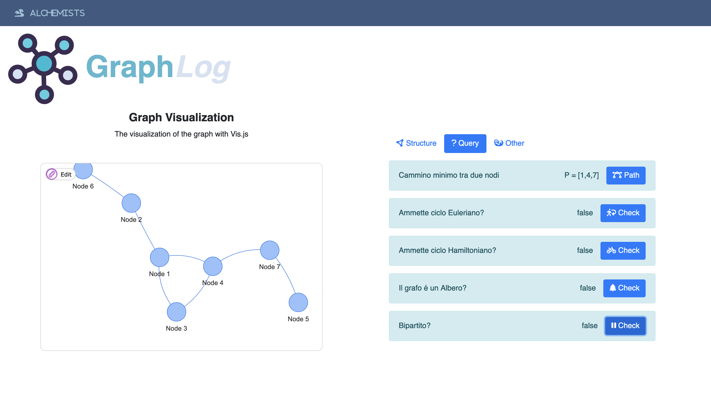

<p align="center" style="margin-bottom:5px;">
  
</p>

<h1 align="center" style="font-weight:800; font-size:80px"> GraphLog</h1>

Progetto universitario per la realizzazione di un agente che consenta di eseguire analisi su grafi. Si tratta di una single-page application scritta in `HTML` e `JS` per consentire la facilità di utilizzo del linguaggio dichiarativo `prolog`. Le principali tecnologie utilizzate sono:

- </img> [VisJS](https://visjs.org/): libreria js per la visualizzazione e manipolazione di grafi 
- </img> [TauProlog](http://tau-prolog.org/): interprete prolog per il js

L'obiettivo principale è quello di realizzare un applicativo che consenta di realizzare in maniera intuitiva e semplice analisi su grafi e di riportare i principali modelli di programmazione matematica in un linguaggio dichiarativo come prolog.


### Screenshot
#### Home
Sulla sinistra è possibile visualizzare un grafo di default, sulla destra invece delle aree per inserire nodi e archi in formato JSON. Inoltre è possibile premere il pulsante "Random" per far generare a GraphLog un grafo casuale per poi passare all'analisi.


#### Structure
Sono riportati i risultati delle query principali che riguardano proprietà strutturali del grafo analizzato. Per richiamare queste ultime è stato definito un predicato, chiamato `init\0`, che esegue le query e tramite la liberia `dom` (messa a disposizione da tau-prolog) di manipolare i tag HTML della pagine per iniettare il contento al loro interno.


#### Query

Nella schermata Query è possibile interrogare l'interprete prolog riguardo a caratteristiche dei grafi molto utili nel caso in cui si stiano modellando dei problemi reali mediante tali strutture. Selezionando il tasto per il cammino minimo si apre un pop-up che permette di inserire ID del nodo di partenza e di arrivo, il submit innesca la query il cui risultato è visualizzabile a schermo.
Le altre query allo stato attuale ritornano solamente risposta true o false, sono state previste funzionalità che permettono di visualizzare graficamente i risultati.



## Utilizzo e Installazione

Per installare il progetto in locale eseguire i seguenti step:

1. Clonare la repository in locale o scaricando lo zip del sorgente o tramite terminale con il seguente comando
```
git clone https://github.com/OT-Rax/Graphlog.git
```
2. Eseguire un web server tramite XAMPP o simili
3. Spostare la cartella `Graphlog` all'interno della document root del web server
4. Aprire il browser e cercare `localhost`

## Ambiente di Lavoro
Specifichiamo l'ambiente, e le sue caratteristiche, in cui dovrà operare l'agente.
| **Agent Type**  | **Performance Measure** |  **Enviroment** | **Actuators**  |  **Sensors** |
|---|---|---|---|---|
|  Symple Reflex | None |  Different type of graphs | Web Inteface  | User Interface  |


Le proprietà dell'ambiente sono necessarie per determinare il modello da applicare e per realizzare una buona progettazione.

| **Task Enviroment**  | **Observable** |  **Agents** | **Deterministics**  |  **Episodic** | **Static** |  **Discrete** |
|---|---|---|---|---|---|---|
|  Graph Analysis |  Fully |  Single |  Deterministic | Episodic  | Semi| Discrete |

## Prolog
L'applicativo dispone di un interafaccia grafica che consente all'utente di caricare il proprio grafo seguendo la notazione `json`. Una volta premuto il submit
apparirà una schermata che presenterà all'utente la rappresentazione grafica del grafo da lui indicato e una serie di informazioni ed azioni da eseguire sul grafo.

### Facts
I fatti, attraverso i quali descriviamo il grafo in prolog, sono i seguenti:
- Per descrivere la presenza di un nodo `x` utilizziamo il predicato 
   ```prolog
     node(x).
   ```
- Per descrivere la presenza di un arco tra il nodo `x` e il nodo `y` utilizziamo il predicato
  ```prolog
    edge(x,y).
  ```
- Poichè consideriamo grafi simmetrici non teniamo conto dell'orientamentpo degli archi e definiamo le seguenti regole
  ```prolog
    edge_s(X,Y) :- edge(Y,X).
    connected(X,Y) :- edge_s(X,Y); edge(X,Y).
   ```

### Rules
L'agente che abbiamo realizzato è del tipo **Simple-Reflex** in quanto esegue una azione in riposta ad una certa condizione. La percezione che funziona da trigger per le azioni prestabilite è l'interazione da parte dell'utente tramite UI. 

Segue una lista delle action implementate e delle regole che le realizzano:

- [X] **Determinare il numero di nodi**: la regola `list_lenght\2`, data una generica lista, ne conta la lunghezza; costruiamo una lista che contiene tutti gli oggetti della relazione unaria `node\1` e la lunghezza di questa lista è proprio il numero di nodi. 
La rules `n_nodes\1` non fa altro che crare la lista dei nodi e calcolarne la lunghezza.
  ```prolog
    list_lenght([],0).
    list_lenght([_|T],N1) :- list_lenght(T,N), N1 is N+1.
    list_node(L) :- findall(X, node(X), L).
    n_nodes(N) :- list_node(X), list_lenght(X,N).
  ```
  
- [X] **Determinare il numero di archi**: si procede in maniera analoga a quanto visto per la regola precedente, definiamo una regola che crea una lista degli archi e poi se ne calcola la lunghezza. Implementata dalla regola `n_edges\1`.
  ```prolog
    list_edge(L) :- findall(X, edge(X,_), L).
    n_edges(N) :- list_edge(X), list_lenght(X,N). 
   ```
 
- [X] **Determinare la densità del grafo**: la densità del grafo è definita come il rapporto rapporto tra il numero di archi presenti nel grafo e il massimo numero di archi che il grafo può contenere (ovvero nel caso in cui siamo completamente connesso e simmetrico è il coefficente binomiale). Fornisce un indicazione in sulla connettività del grafo e su quanti archi possiasmo ancora aggiungere.
  ```prolog
    bc(N, 0, 1) :- N #>= 0.
    bc(N, N, 1) :- N #> 0. 
    bc(M, N, R) :-
      N #> 0, M #> N, R #>= M,       
      M1 #= M - 1, N1 #= N - 1,
      bc(M1, N1, R1), bc(M1, N, R2),
      R #= R1 + R2
    .
    truncate(X,N,Result):- X >= 0, Result is floor(10^N*X)/10^N, !.
    graph_density(N) :- n_nodes(V), n_edges(E), bc(V,2,X), T is E/X, truncate(T,2,N).   
  ```
  Nota: Invece che usare is, il quale è più un approccio imperativo, si utilizzano gli operatori della constraint logic programming  (CLP) in quanto  prolog fornisce supporto anche a quest'ultima.
- [X] **Determinare la stella di un nodo e il suo grado**: la stella di un nodo è l'insieme di archi incidenti al nodo, `star\1` non fa altro che creare una lista di tutti quei nodi che sono adiacenti al nodo `X` (facciamo uso della regola `connected\2` in quanto trattiamo grafi simmetrici). Il grado del nodo non è altro che la cardinalità della stella perciò ci basta calcolare la lunghezza della lista risultante.
  ```prolog
    edge_s(X,Y) :- edge(Y,X).
    connected(X,Y) :- edge_s(X,Y); edge(X,Y).
    star(X,L) :- findall(Y, connected(X,Y), L).
    degree(X, N) :- star(X,L), list_lenght(L,N). 
  ```
- [x] Determinare il nodo con grado minimo/massimo: per calcolare il nodo di grado massimo/minimo abbiamo utilizzato rispettivamente un predicato che dopo aver determinato tutte le possibili stelle determina quella di dimensione maggiore/minore, e tramite il metodo `star` risaliamo al nodo in questione.
  ```prolog
  minimum_star(N,X) :- findall(Y, star(_, Y), L), minimum_list_in_lists(L, X), star(N, X).
  maximum_star(N,X) :- findall(Y, star(_, Y), L), maximum_list_in_lists(L, X), star(N, X).
  ```

- [X] **Percorso tra due nodi**: un percorso è una sequenza di nodi (o archi) adiacenti che non si ripetono, per determinare il percorso tra due nodi abbiamo bisogno di costruirlo in maniera incrementale. La regola `part_of_path\4` è una relazione tra i nodi di partenza e arrivo, i nodi visitati fino a quel momento e il path complessivo. Se X non è connesso direttamente a Y allora cerco uno Z che non è membro di quelli visitati che connesso a Y o a sua volta connesso a qualcuno che è connesso a Y.
    ```prolog
      path(X,Y,P) :- part_of_path(X,Y,[],L), reverse(P,L).  
      part_of_path(X,Y,V,[Y|[X|V]]) :- connected(X,Y).
      part_of_path(X,Y,V,P) :- connected(X,Z), not(member(Z,V)), Z =\= Y, part_of_path(Z,Y,[X|V],P).
    ```
- [X] **Determinare il percorso minimo tra due nodi**: per determinare il percorso di lunghezza minimi dati due noti `X` e `Y`, cerchiamo tutti i possibili percorsi che li collegano e cofrontiamo le loro lunghezze. Per ogni percorso, che non è altro che un array, ne confrontiamo la lunghezza con il minimo incontrato fino a quel momento; se ne troviamo uno più corto allora aggiorniamo il valore del minimo.
    ```prolog
      shortest_path(X,Y,P) :- path(X,Y,P), shortest_path_length(X,Y,N), list_lenght(P,N).
      shortest_path_length(X,Y,N) :- setof(P, path(X,Y,P), Set), shortest_array_length(Set, N).
      shortest_array_length([H|T], N) :- list_lenght(H,Z), shortest_array_length_procedure([H|T], Z, N).
      shortest_array_length_procedure([H], Min, N) :- list_lenght(H, Z), N is min(Min, Z).
      shortest_array_length_procedure([H|T], Min, N) :- list_lenght(H, L), Min2 is min(Min,L), shortest_array_length_procedure(T, Min2, N).
    ```

- [X] **Determinare se il grafo è connesso**: un grafo è connesso se è composto da una sola componente connessa ovvero se a partire da qualsiasi nodo posso raggiungere tutti gli altri. La regola `exist_path\2` determina se esiste un percorso tra il nodo corrente e tutti gil altri del grafo. La regola `connected_graph\1` itera questa procedura per tutti i nodi. 
    ```prolog
      connected_graph([H]) :- node(H).
      connected_graph([H1|[H2|T]]) :- exist_path(H1, [H2|T]), connected_graph([H2|T]), !.
      exist_path(X, [H]) :- path(X,H,_), !.
      exist_path(X, [H|T]) :- path(X,H,_), exist_path(X, T), !.
    ```
- [X] **Determinare se il grafo è Euleriano**: dal Teorema di Eurelo sappiamo che un grafo è eureliano (ammette ciclo euleriano) se è connesso e se ogni nodo ha grado pari. Quindi riutilizziamo la regola che determina se il grafo è connesso e richiediamo che il grado di ogni nodo sia pari, per farlo utilizziamo la regola `even\1`.
    ```prolog
      even(X) :- Z is mod(X, 2), Z == 0.
      eulerian([H]) :- degree(H, N), even(N).
      eulerian([H|T]) :- connected_graph([H|T]), degree(H, N), even(N), eulerian(T), !.
    ```
- [X] **Determinare ciclo Hamiltoniano sul grafo**: un ciclo Hamiltoniano attraversa tutti i nodi del grafo una e una solta volta; per prima cosa tra tutti i path controllo che ne esista uno che inizia in un nodo e finisce in un nodo connesso al nodo iniziale, se un path di questo tipo esiste allora controllo che l'ultimo elemento del Path sia connesso al primo nodo e che la lunghezza del percorso ottenuta sia pari al numero di nodi.
    ```prolog
      hamiltonian([H|T], P) :- check_hamiltonian_cycles(H, T, P).
      check_hamiltonian_cycles(X, [H|T], Y) :- path(X,H,P), n_nodes(N), list_lenght(P, N), last(Z, P), connected(Z,X), append(P, [X], Y), !.
      check_hamiltonian_cycles(X, [H|T], P) :- check_hamiltonian_cycles(X, T, P). 
    ```
- [X] **Determinare se il grafo è un albero**: un grafo simmetrico è un albero se e solo se risulta connesso e ha un numero di archi pari al numero di nodi meno. Allora affinchè il grafo sia un albero deve soddisfare `conntected_graph` e inoltre che il numero di nodi e il numero di archi rispettino la relazione descritta.
Abbiamo deciso di mettere prima la condizione sui nodi ed archi poichè si riesce a verificare più velocemente rispetto alla connesione del grafo.
    ```prolog
      tree([H|T]) :-  n_nodes(N), n_edges(Z), Y is N-1, Z==Y, connected_graph([H|T]).
    ```
- [X] **Determinare coperture con nodi**: si tratta di un insieme di nodi che toccano tutti gli archi del grafo. Quello che facciamo e prendere un sottoinsieme di nodi e vedere quali archi copre, lo facciamo tramite il predicato `edge_covered_by_nodes`, a cui passiamo tutti i possibili sottoinsieme di archi e il sottoinsieme di nodi. Andando a ricercare la lista di nodi più piccola che lo soddisfa abbiamo trovato la minima copertura con nodi 
    ```prolog
      minimum_length([H|T], X) :- list_lenght(H, N), minimum_length_calculation(T, N, Y), X is min(N,Y).
      minimum_length_calculation([H|T], U, X) :- list_lenght(H, N), Z is min(U,N), minimum_length_calculation(T, Z, X).
      minimum_length_calculation([H|T], U, X) :- list_lenght(H, N), X is min(U,N).
      minimum_list_in_lists(L, X) :- minimum_length(L, N), member(X,L), list_lenght(X,M), N==M, !.

      vertex_cover(X) :- list_node(L), subset(L, X), setof(Y, edge_array(Y), E), edge_covered_by_nodes(X,E).
      edge_covered_by_nodes(X, [H]) :- subtract(H,X,S), list_lenght(S,N), N=<1.
      edge_covered_by_nodes(X, [H|T]) :- subtract(H,X,S), list_lenght(S,N), N=<1, edge_covered_by_nodes(X, T).
      minimum_vertex_cover(V) :- setof(X, vertex_cover(X), S), minimum_list_in_lists(S, V).
    ```
- [X] **Determinare coperture con archi**: si tratta di un insieme di archi che tocca tutti i nodi del grafo; abbiamo pensato di costruire due liste di nodi composte rispettivamente dai nodi da cui partono gli archi e una dai nodi in cui arrivano gli archi. Se l'unione di queste due liste compone l'intero insieme dei nodi abbiamo trovato una copertura (le confrontiamo tramite il predicato `same`), il predicato `edge_array` crea una lista degli archi che formano una copertura. Per trovare quello minimo ci basta prendere il set composto da tutte le possibili liste di archi che formano una copertura e prendere quella di lunghezza minima.
    ```prolog
      edge_cover(X) :- setof(Y, edge_array(Y), E), subset(E,X), covered_nodes(X, N), list_node(L), same(L,N).
      covered_nodes(E, N) :- elements_union(E, X), sort(X, N).
      elements_union([H|T], X) :- elements_union_steps(T, H, X).
      elements_union_steps([H], U, X) :- append(H, U, X).
      elements_union_steps([H|T], U, X) :- append(H, U, Z), elements_union_steps(T, Z, X).
      minimum_edge_cover(E) :- setof(X, edge_cover(X), S), minimum_list_in_lists(S, E).
    ```
- [X] **Determinare gli abbinamenti**: è un insieme di archi non adiacenti; se un arco fa parte dell'insieme allora tutti gli altri nodi che partono dal primo o dal secondo nodo non possono farne parte. Per esprimere questa proprietà utilizziamo il predicato `array_dont_intersect` tramite il quale teniamo conto dei nodi non ancora toccati e dunque degli archi che sono rimasti a disposizione, una volta che tutti i nodi sono stati toccati abbiamo trovato un abbinamento. Andando a prendere il set di tutti i possibili abbinamenti e cercando quello di lunghezza massima troviamo l'abbinamento massimo.
    ```prolog
      matching(E) :- setof(X, edge_array(X), S), subset(S, E), arrays_dont_intersect(E).
      edges_subset(E) :- setof(X, edge_array(X), S), subset(S, E).
      arrays_dont_intersect([H]).
      arrays_dont_intersect([H|[H1|T]]) :- intersection(H,H1,X), list_lenght(X,N), N==0, arrays_dont_intersect([H|T]), arrays_dont_intersect([H1|T]).
      maximum_matching(M) :- setof(X, matching(X), S), maximum_list_in_lists(S,M).
    ```
- [X] **Determinare l'insieme stabile massimo**: un insieme stabile è composto da nodi che non sono adiacenti, dunque affinchè due nodi appartengano a tale insieme non devono essere connessi direttamente; per questo motivo abbiamo definito il predicato `disconnected/2` che dato un nodo verifica che questo non sia connesso con il resto della lista. La regola `subset` definisce una possibile sottolista, dunque utilizzato insieme a `setof` fornisce tutto lo spazio di ricerca per il nostro problema. Una volta determinato lo spazio di ricerca per il stable_set e ottenuto i vari risultati sotto forma di una lista di lista, cerchiamo il più grande tra queste tramite il metodo `maximum_list_in_list`. 
    ```prolog
      subset([], []).
      subset([E|T], [E|NT]):- subset(T, NT).
      subset([_|T], NT):- subset(T, NT).
      
      disconnected(X, [H]) :- node(X), node(H), X=\=H, not(connected(X,H)).
      disconnected(X, [H|T]) :- node(X), node(H), X=\=H, not(connected(X,H)), disconnected(X, T).
      
      stable_set([]).
      stable_set([H]) :- node(H).
      stable_set([H|T]) :- list_node(X), subset(X,[H|T]), disconnected(H, T), stable_set(T).
      stable_set([H|T]) :- list_node([H|T]), disconnected(H, T), !.
      
      maximum_stable_set(X) :- setof(Z, stable_set(Z), S), maximum_list_in_lists(S, X), !.
      stable_set_of_cardinality(X, C) :- stable_set(X), list_lenght(X, Z), Z==C, !.
    ```
- [X] **Determinare se il grafo è bipartito**: un grafo bipartito se posso dividerlo in due insieme di nodi, in cui tutti i nodi dell'insieme sono tra loto disconessi. Procediamo con il prendere tutti i sottoinsiemi di nodi e li controllo uno ad uno per verificare se esiste un sottoinsieme in cui quei nodi sono disconnessi e in cui anche il complementare dell'insieme selezionato lo sia. Se esistono questi due insiemi il grafo è bipartito.
Prendiamo la lista dei nodi e creiamo un grafo discennesso tramite `disconnected_graph`, tramite `subtract` vediamo otteniamo l'insisme di nodi complementare; se anche questi generano un grafo disconnesso allora abbiamo trovato i due insiemi.
    ```prolog
      disconnected_graph([H]) :- node(H).
      disconnected_graph([H|T]) :- list_node(L), subset(L, [H|T]), disconnected(H, T), disconnected_graph(T).
      biparted(Z) :- list_node(L), disconnected_graph(X), subtract(L,X,Y), disconnected_graph(Y), Z=[X,Y], !.
    ```

### Utility
Nella realizzazione dei predicati abbiamo implementato diverse utility function utili al fine di comprendere al meglio il funzionamento di prolog. Alcuni esempi sono:
- `intersection\3`: trova l'intersezione tra due liste.
```prolog
intersection(_,[],[]).
intersection([],_,[]).
intersection(L1,L2,X) :- intersection_calculation(L1, L2, [], X), !.
intersection_calculation([H|T], L2, C, X) :- member(H,L2), append(C, [H], U), intersection_calculation(T, L2, U, X).
intersection_calculation([H|T], L2, C, X) :- \+member(H,L2), intersection_calculation(T, L2, C, X).
intersection_calculation([H], L2, C, X) :- member(H, L2), append(C, [H], X).
intersection_calculation([H], L2, C, C) :- \+member(H, L2).
```
- `subtraction\3`: rimuove dalla prima lista, tuti gli elementi della seconda lista; il terzo argomento è la lista risultante.
```prolog
subtraction(L1,[],L1).
subtraction([],_,[]).
subtraction(L1,L2,X) :- subtraction_calculation(L1, L2, [], X), !.
subtraction_calculation([H|T], L2, C, X) :- \+member(H,L2), append(C, [H], U), subtraction_calculation(T, L2, U, X).
subtraction_calculation([H|T], L2, C, X) :- member(H,L2), subtraction_calculation(T, L2, C, X).
subtraction_calculation([H], L2, C, X) :- \+member(H, L2), append(C, [H], X).
subtraction_calculation([H], L2, C, C) :- member(H, L2).
```
- `last\2`: determina l'ultimo elemento di una lista.
```prolog
last(X,[X]).
last(X, [_|T]) :- last(X, T).
```
- `ordered\1`: determina se una lista è ordinata.
```prolog
  ordered([]).
  ordered([H]).
  ordered([H| [T|L] ]) :- H=<T, ordered([T|L]).  
```
- `same\2`: determina se la prima lista è uguale alla seconda.
```prolog
same([H1], [H2]) :- H1 == H2.
same([H1|T1], [H2|T2]) :- H1==H2, same(T1, T2), !.
```
- `arrays_dont_intersect\1`:controlla che tutti gli elementi di tutte le liste, le quali sono elementi di una'altra lista, siano tutti differenti.
```prolog
arrays_dont_intersect([H]).
arrays_dont_intersect([H|[H1|T]]) :- intersection(H,H1,X), list_lenght(X,N), N==0, arrays_dont_intersect([H|T]), arrays_dont_intersect([H1|T]).
```


## JavaScript
L'interprete prolog per js mette a disposizione delle regole per manipolare il DOM, abbiamo utilizzato queste regole per far visualizzare i risultati delle query sulla pagina web.
Un esempio è il seguente metodo `init\0` che dopo aver risolto i fatti da noi definiti aggiunge il risultato direttamente all'interno del DOM:
- il meotodo `get_by_id\2` permette di recuperare un elemento del DOM attravderso un ID;
- il metodo `html\2` specificando l'elemento consente di aggionrane il contenuto HTML.

```prolog
:- use_module(library(dom)).

init :- 
    n_nodes(V), get_by_id('result_nodes',TxT1), html(TxT1,V),
    n_edges(E), get_by_id('result_edges',TxT2), html(TxT2,E),
    maximum_stable_set(S), get_by_id('stable_set', TxT3), html(TxT3,S),
    minimum_edge_cover(EC), get_by_id('edge_cover', TxT4), html(TxT4,EC),
    maximum_star(N1,Value1),
    get_by_id('max_star', TxT5), html(TxT5, Value1),
    get_by_id('node_max_star', TxT6), html(TxT6, N1),
    minimum_star(N2,Value2),
    get_by_id('min_star', TxT7), html(TxT7, Value2),
    get_by_id('node_min_star', TxT8), html(TxT8, N2),
    maximum_matching(M), get_by_id('matching', TxT9), html(TxT9,M),
    minimum_vertex_cover(VC), get_by_id('vertex_cover',TxT10), html(TxT10,VC)
.
```

La libreria `vis.js` utilizza come struttura dati per costruire il grafo degli oggetti JSON per questo motivo è necessario convertire tali oggetti nei fatti con cui può lavorare il prolog. La libreria `tau-prolog` mette a disposizione dei metodi built-in per convertire JSON a atomi in prolog, tuttavia abbiamo preferito creare dei nostri metodi per eseguire questa conversione in quanto è stata utilizzata anche per la manipolazione del grafo.
Per l'illustrazione del funzionamento di GraphLog utilizziamo il seguente esempio di riferimento:

<table align="center">
<tr>
<td align="center"> Nodes </td>
<td>

```json
[
  {"id":1,"label":"Node 1"},
  {"id":2,"label":"Node 2"},
  {"id":3,"label":"Node 3"},
  {"id":4,"label":"Node 4"},
  {"id":5,"label":"Node 5"},
  {"id":6,"label":"Node 6"},
  {"id":7,"label":"Node 7"}
]
```
</td>
</tr>
<tr>
<td width="200px" align="center"> Edges </td>
<td>

```json
[
  {"from":1,"to":2},
  {"from":1,"to":3},
  {"from":1,"to":4},
  {"from":3,"to":4},
  {"from":4,"to":7},
  {"from":5,"to":7},
  {"from":2,"to":6}
]
```
</td>
</tr>
</table>

Una volta eseguito l'upload degli archi e dei nodi attraverso gli appositi campi comparirà un piccolo menù che consente all'utente di:
- visualizzare informazioni riguardanti la struttura del grafo
- eseguire delle tipiche query su delle proprietà che il grafico può avere, che tuttavia risultano molto dispendiose da effetturare, in termini di tempo, manualmente.

## Contributors
<table>
  <tbody>
    <tr>
    <td align="center"><a href="https://github.com/OT-Rax"><br /><sub><b>Rahmi El Mehcri</b></sub></a><br /></td>
    <td align="center"><a href="https://github.com/DavideDeZuane"></img><br /><sub><b>Davide De Zuane</b></sub></a><br /></td>
    </tr>
   </tbody>
  </table>
